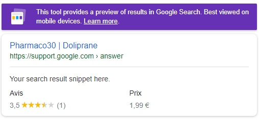

# Portfolio - Rich snippets
[> Page détaillé de l'exercice sur mon site <](http://neo-explorer.com/portfolio/rich-snippet "Page de l'exercice sur mon site")

Petite exercice sur l'utilisation des métadonnées avec les microdata/JSON-LD pour obtenir sur Google un produit "Rich snippet" afin d'améliorer son rendu dans les moteurs de recherche.

## Principe
Utiliser les métadonnées avec les microdata/JSON-LD pour obtenir sur Google un produit "Rich snippet". Lors d'une recherche sur le moteur de Google, elles permettront d'enrichir les résultats des produits d'un site, de détails les concernants comme le prix, la disponibilité, la description ou encore la notation.

